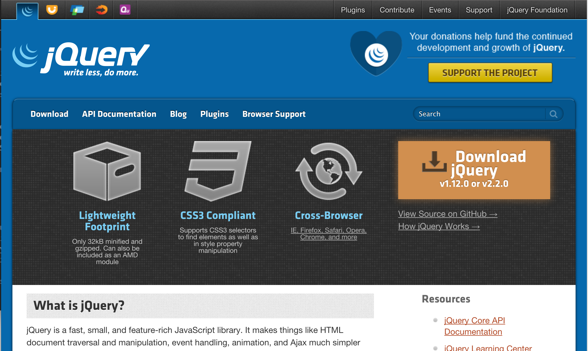
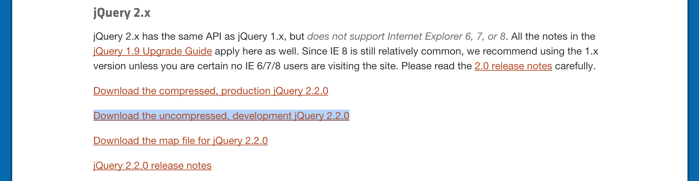
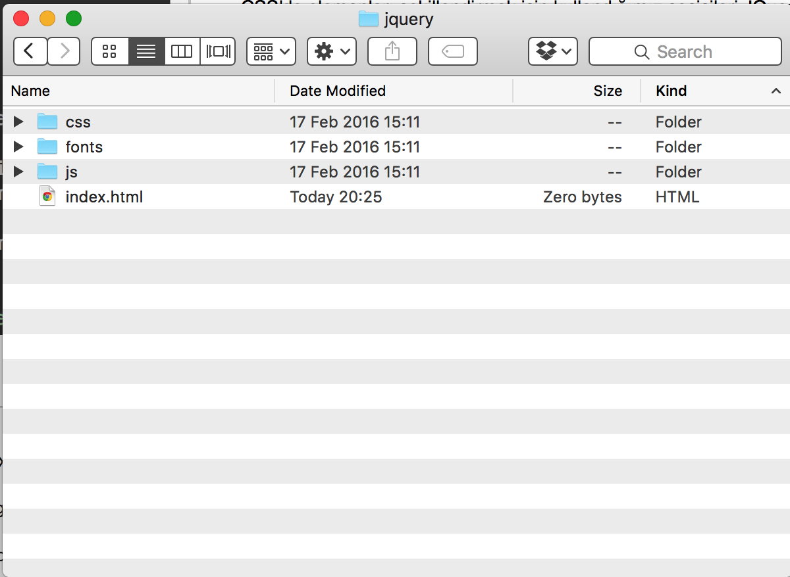
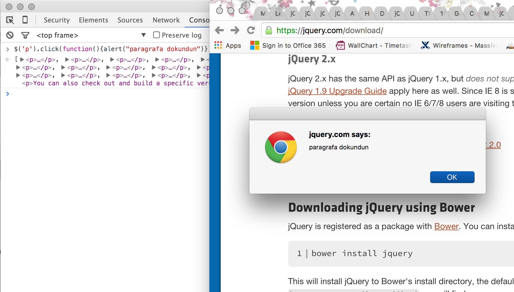

#JQuery

> "Actioni contrariam semper et æqualem esse reactionem."
> "Her etkiye karşı zıt ve eşit bir tepki vardır."
>  
> Isaac Newton

## Giriş

Kitabımız bir Javascript kitabı olmadığı için bu konuya uzun uzadıya girmemize gerek yok. Ancak yine de javascript'in ne olduğunu, ne için kullanıldığını kısaca özetlemeliyiz ki JQuery konusunu anlayalım.

### JavaScript

Bir programlama dilidir. Çoğu özelliği ile PHP'ye benzese de, temelde pek alakası olduğunu söyleyemeyecğim. Hatta bazen bir PHP geliştiricisi olarak JavaScript kodu okurken beynim duruyor diyebilirim. Peki neden icad edilmiş diyecek olursanız, 1995 yılında Netscape firmasında çalışan Brendan Eich tarafından kullanıcıların tarayıcıda girdikleri form verilerini, sunucuya gönderilmeden kontrol etmek için diyebiliriz. Kaynak: [http://speakingjs.com/es5/ch04.html](http://speakingjs.com/es5/ch04.html)

Biz daha önce HTML'nin web sunucularına gönderilen istek sonucu tarayıcıda görüntülenen sayfanın dili olduğunu öğrenmiştik. PHP ise HTML dosyasına, kullanıcıdan gelen isteğe göre müdahele etmemizi sağlayan script "betik" diliydi ve sunucu tarafında çalışıyordu. JavaScript ise Tarayıcı tarafında içerikler henüz sunucuya gönderilmeden, kullanıcıların etkileşimlerine müdahele edebilmemizi sağlayan araç ve programlama dilidir. Son yıllarda Node.js sayesinde JavaScript sunucu tarafında çalışır hale geldi ve JavaScript ile sunucu uygulamaları da yapmak mümkün hale geldi. Ama dediğim gibi bu da baya uzun ve başka bir kitabın konusu.

### JQuery Nedir?

En çok kullanılan JavaScript kütüphanesidir. 

> Bir yazılım **kütüphanesi**, bir amaca yönelik en çok kullanılan metod ve sınıfları bir araya getirip paketleyerek yeniden kullanmamızı ve tekrar tekrar yazmamızı önleyen yazılım parçacığıdır.

JQuery is web üzerinde JavaScript ile en çok yaptığımız işlemleri bir araya getiren, çok amaçlı çakı misali bir kütüphanedir. Peki nedir o işler?

1. Tarayıcıda açılmış sayfayla canlı olarak oynamak. `Dom Manipulation`
2. Kullanıcının yaptığı işlemlere göre farklı tepkiler vermek `Events`
3. Sayfayı yenilemeden başka sunuculara başka istekler yollamak, veri çekmek. `AJAX`
4. Efektler ve animasyonlar
5. CSS şablonuna müdahele etmek
6. Faydalı araçlar

Daha fazla bilgi için: 

* [https://en.wikipedia.org/wiki/JQuery](https://en.wikipedia.org/wiki/JQuery)
* [http://www.w3schools.com/jquery/jquery_intro.asp](http://www.w3schools.com/jquery/jquery_intro.asp)

### Neden Jquery peki?

* JQuery neden bu kadar popüler diye soracak olursanız, bence JavaScript gibi bi dili öğrenmeye üşenen tasarımcılar,
* Bir sürü ayrı tarayıcıda farklı faklı yapılan işlemleri, tek bir koda indirgemesi,
* Kullanımı ve öğrenmesi kolay olması
* İnternette yaygın kaynaklarının olması gibi seçenekler saymam mümkün.

### Nasıl öğrenceğiz

Bu kitapta baştan sona yaptığım gibi, JQuery kütüphanesinin tek tek her özelliğini açıklayarak rehber yazmayacağım. Zaten konunun mantığını anladığınızda daha derinlemesine bilgiyi hem anlamanız hem de bulmanız daha kolay hale gelecek. Kısaca ana bileşenleri ve kavramları açıkladıktan sonra örneklerle devam edeceğiz.

## Jquery Mantığı

Öncelikle daha önce öğrendiğimiz şekliyle bir web sayfasını hayalimizde canlandıralım. Bir web sayfası genel olarak şunlardan oluşuyordu:

1. HTML etiketleri
2. Tarayıcıda görebildiğimiz ve göremediğimiz kısımlar
3. (Varsa) Görünüme müdahele ettiğimiz CSS şablonları
4. JavaScript kütüphaneleri

HTML etiketlerinin, görüntülenen imajlar, başlıklar, yazılar, makaleler, linkler ve görüntülenmeyen meta, head gibi etiketlerden oluşturklarını biliyoruz. Bunlar da şimdi zihnimizin bir köşesinde dursun. 

### Olay

Ancak bu zamana kadar açıklamadığımız kısım şu. Etkileşim. Bir tarayıcı, kullanıcının yaptığı işlemlere göre tepki verir. Bir yere tıkladığında, sayfayı kaldırdığında, cep telefonundaysa dokunduğunda, metin seçtiğinde bu olaylara göre tepki vermesi gerekir. Bu yüzden tarayıcı internet sayfasında gezinirken yaptığınız bütün işlemleri takip eder, sizi gözler ki sizin isteklerinize anında cevap verebilsin. İşte sizin yaptığınız, kendi kendine olan, başka bir olayı tekip edev bu olaylar zincirine "Olaylar" ya da ingilizcesiyle `Events` diyoruz. 

### Dinleyici

Newton'un dediği gibi bir olay olduğunda, her zaman tepki de vardır. Yani tanımadığn birisi sokakta sana tokat attığında, ya sen de ona tokat atarsın, ya öbür yanağını çevirirsin, ya da hiçbişey yapmasan dahi, yanağın kızararak olaya tepki verir. Tarayıcı sürekli bizi gözetlediği ve olan olayları takip ettiği için bu olaylara tepki vermek durumundadır. Ancak hangi olaylara ne tepki vereceğini önceden bilmek durumundadır. 

Mesela bir linke tıkladığımızda, sayfayı bize hissettirmeden değiştirmelidir. Ya da bir form girişi seçtiğimizde, o girişi seçtiğimizi anlamalı, ve yazacaklarımızı dinlemeye başlamalıdır. Bu olaylara karşı farklı tepki veren şey "Dinleyiciler" veya İngilizcesiyle `Listeners` olarak adlandırılır.

### Eleman

Herhangi bir olayın nerede olduğu vereceğimiz tepkiyi de değiştirir. Yani her olaya aynı tepkiyi veremeyiz. Örneğin kardeşimizin doğum günü geldiğinde vereceğimiz tepki, halamızın kızının doğumgününe vereceğimiz tepkiyle aynı olmayacaktır. Yani olaylar ve tepkiler bağlama göre değişirler. Tarayıcı tıkladığınız her linke aynı tepkiyi verse, tüm sayfadaki linkler aynı yere giderlerdi ve istediğimiz işi yapmamış olurlardı. Burada tepki vereceğimiz olayın bağlantılı olduğu yapıya "Eleman" ya da İngilizce `Element` diyoruz.

Biz web sayfalarıyla ilgilendiğimiz için bütün bu elemanlar HTML dosyasının bir parçası.

### Belge Nesne Modeli - Document Object Model (DOM)


> By Brian Green, CC BY-SA 2.0, https://commons.wikimedia.org/w/index.php?curid=13127021

Başlık kafamızı karıştırmasın, çünkü aslında bu kavramı öğrendik. Daha önce HTML'yi oluşturan XML yapısını anlamıştık. Bir HTML dosyası iç içe geçmiş HTML etiketlerinden oluşuyordu. Tüm HTML sayfları en önce bir html etiketi ile başlıyorlardı. `<html></html>` Standart bir html dosyası şu etiketlerden oluşuyordu:

```html
<!DOCTYPE html>

<html>
<head>
	<meta charset="UTF-8">
	
	<title>Title of the document</title>
</head>

<body>
Sayfa içeriği
</body>
</html>
```

Etiketler `<meta charset="UTF-8">` örneğinde görüldüğü gibi kapatılmadan, ya da `<title>Title of the document</title>` örneğindeki gibi kapatılarak da kullanılabiliyordu. `<meta charset="UTF-8">` etiketindeki "charset" kelimesi etiketin özelliği `attribute` ve tırnak işaretleri içindeki "UTF-8" verisi de o özelliğe atadığımız değeri temsil ediyordu. İlk başta kullanılması ve öğrenilmesi bu kadar basit olduğu için HTML dünya çapında internetin standart dili haline gelmiştir.

Peki "etiket" ve "eleman" dediğimiz kavramların birbirlerinden farkı nedir? Bir eleman, açılış etiketi, özellikler, içerik ve kapanış etiketinden oluşabilir. Yani etiketler, tarayıcı tarafından okunup, anlaşılır bir hale geldikten sonra eleman haline gelirler.

Tarayıcılar bu elemanlara istedikleri zaman ulaşabilmek için, önce dosyayı okurlar, daha sonra da onları nesneler halinde getirirler. Bu işlemin nasıl yapıldığını şu an anlamadıysanız sorun değil. Zaten tarayıcı bizim için yapıyor bu işlemi. Sayfayı açtığımızda tarayıcı kendi hafızasında ağaç benzeri bir yapı oluşturur. Bu sayede `<section>` ile belirttiğimiz bir bölümde kaç tane link `<a href="#"><a>` kaç tane paragraf `<p>Paragraf<p>` olduğunu sorgulayabiliriz. İşte bu sorgulamayı yapmamızı sağlayan varlığa "Belge Nesne Modeli (DOM)" ya da `Document Object Model (DOM)`  deniyor. Bu konudaki detayları merak ediyorsanız bölüm sonundaki kaynaklardan öğrenebilirsiniz. Ama biz şimdilik ihtiyacımız olan kısmını bilsek yeter.


> Kaynak: https://www.kirupa.com/html5/javascript_the_browser_and_the_dom.htm

## Seçiciler

Daha önce CSS kısmında internet sayfamınızın içindeki bir elemanı nasıl şekillendireceğimizi kısaca öğrenmiştik. Aslında JQuery derken en önce öğrenmemiz gerek kavram bu. HTML sayfamızdaki elemanlara şu şekilde ulaşabiliriz.

1. Etiket isimleriyle `p, a, img` gibi.
2. Class özelliği ile: Etiket: `<p class="important-paragraph">Paragraph</p>`  seçmek için: `p.important-paragraph`
3.  id özelliği ile: Etiket: `<p id="main-paragraph">Paragraph</p>`  `p#main-paragraph`
4. Sözde elemanlar ile öreğin ilk paragrafı bulmak için `p:first`
5. Veya bir etiketin, özelliğinin aldığı veriye göre Etiket: `<a href="mynameismidori.com"> mynameismidori.com</a>` seçmek için: `a[href='mynameismidori.com']`

Eğer kafanız karıştıysa sorun değil, bu listedeki seçicilerin hepsi için ayrı ayrı örnekler yapacağız. Daha da ayrıntılı ve değişik seçiciler oluşturabiliriz ancak şimdilik detaya girmiyoruz. CSS'de elemanları şekillendirmek için kullandığımız seçicileri JQuery'de elemanları seçerken kullanabiliyoruz. JQuery'nin tasarımcılar tarafından sevilerek kullanılmasının bence en önemli nedeni de bu.

## JQuery kütüphanesini kurmak

JQuery açık kaynaklı bir JavaScript kütüphanesi olduğu için herhangi bir kurulum işlemine ihtiyacımız yok. JQuery kütüphanesini 3 ayrı şekilde web sayfamızda kullanabiliriz. Birincisi javascript dosyasını indirip js diziniimize kopyalayabiliriz. Bunun için şu adımları takip etmemiz gerek:

1. [https://jquery.com/](https://jquery.com/) sayfasını açalım. "Download JQuery" linkine tıklayalım. 



2. Açılan sayfada [Download the uncompressed, development jQuery 2.2.0](http://code.jquery.com/jquery-1.12.0.js) linkine tıklayalım ve 'http://code.jquery.com/jquery-2.2.0.js' adresinden dosyayı indirelim.



3. İndirdiğimiz dosyayı internet sayfamızın olduğu dizinin altında js dizinine kopyalayalım.



4. HTML sayfamızdan bu dosyaya referans verelim.

```html
<!DOCTYPE html>
<html>
<head>
	<meta charset="UTF-8">
	<title>Title of the document</title>
	<script src="js/jquery-1.12.0.js">
</head>
<body>
Sayfa içeriği
</body>
</html>
```

İkincisi internette CDN denen başka sunuculardan jquery'ye referans verebiliriz. Ancak bu yöntemle çalışırken, sayfamızın internete bağlı olması gerekiyor. Yani internet yoksa, JQuery tarayıcı tarafından indirilmez.

Bu yöntemde de ekteki gibi uzak sunucu dosyalarını `<head>` etiketin içine `<script>` etiketiyle ekliyoruz.

```html
<!DOCTYPE html>
<html>
<head>
	<meta charset="UTF-8">
	<title>Title of the document</title>
	<script src="//code.jquery.com/jquery-1.12.0.min.js"></script>
	<script src="//code.jquery.com/jquery-migrate-1.2.1.min.js"></script>
</head>
<body>
Sayfa içeriği
</body>
</html>
```

Üçüncü yöntem ise "Bower" isimli aracı kullanmak. Bower JavaScript için yararlı bir kütüphane yönetim aracı, araç ancak kitabımızın konusu JavaScript olmadığı için bu konuyu araştırmayı size bırakıyorum.

## Jquery kodu

Temel kavramları anladığımıza göre JQuery kodu yazmaya giriş yapabiliriz. Temel olarak bir JQuery kodu şöyle yazılır:

```Javascript
$('seçici').olay(dinleyici);
```

Burada "dinleyici" yan `listener` dediğimiz kavrama "hareket" yani `action` dendiği de oluyor. Aslında şu aşamada "JQuery bu kadar, dağılın!"  desem de olur, çünkü JQuery JavaScript ile yapılan işleri gerçekten bu kadar basitleştiriyor. Ancak kitabımızın adı "Projelerle PHP" olduğu için devam edelim.

Diyelim ki en basitinden sayfadaki tüm paragraflara tıklayınca, uyarı olarak "paragrafa dokundun" diyecek bir kod parçası yazmamız gerek.

```Javascript
$('p').click(function(){alert("paragrafa dokundun")});
```
Açıklayayım. `$('p')` ile sayfadaki bütün `<p>` etiketiyle başlayan paragraf elemanlarını seçtik. `click` seçeneği ile dinleyeceğimiz olayı belirledik. `function(){alert("paragrafa dokundun")}` kısmında ise olay olduğunda yapacağımız işi belirttik. Bu nasıl metod demeyin. Bu adı sanı ismi cismi belli olmayan anonim method. Sadece lazım olduğunda kullanmamıza yarıyor. JavaScript'te bir süredir vardı. Son zamanlarda PHP'ye de geldi. Burası yine kafanızı karıştırmasın, bizi ilgilendiren "{}" süslü parantezlerin arasındaki kısım. Orada sadece alert metodunu çağırıp ekranda uyarı veriyoruz.

Herhangi bir sayfada JavaScript konsolunda bu kodu çalıştırıp, bir paragrafa tıkladığımızda, (eğer JQuery'i doğru kurulmuşsa tabii) karşılaşmamız gereken görüntü şu:



JavaScript kodu aşağı yukarı PHP ile benzerlik gösterse de benzerlik genellikle görüntüde kalıyor. Ancak örnekler kısmında işimize yarayacak ve anlayabileceğimiz kadar JavaScript kodu kullanacağız.

## Örnekler

Kitaptaki örneklerin genellikle işimize yarar örnekler olmasına dikkat ediyorum. Sonuçta kimse her paragrafa tıklandığında, "Paragrafa dokundun" diyen ruh hastası bir kodu kullanmak istemez. O yüzden daha önce yaptığımız sayfalarda olduğu gibi, işimize yarayacak ve yaramaya devam edecek, gerçek hayattan örnekler vereceğim.

1. Form verisini, sunucuya göndermeden önce kontrol etmek. `Input Validation`
2. Sayfa açıldıktan sonra, yönlendirme yapan basit bir script. `Window Events`
3. Şehir seçtikten sonra ilçeleri gösteren seçenek oluşturan script. `Ajax`

Şu an JQuery'ye giriş yapmak ve PHP öğrenimimize destek olmak için bu ilk üç örnek yeterli.

### Form Kontrolü

Bölümün başındaki JavaScript tarihçesini okuduysanız, JavaScript'in bu amaç için icat edildiğini görmüşsünüzdür. Gerçi JavaScript artık form kontrolünden daha çok işleve sahip. Ama yine de tarihi bir örnek olması açısından bununla başlayalım.

PHP bölümünde sunucuya form göndermeyi öğrenmiştik. 